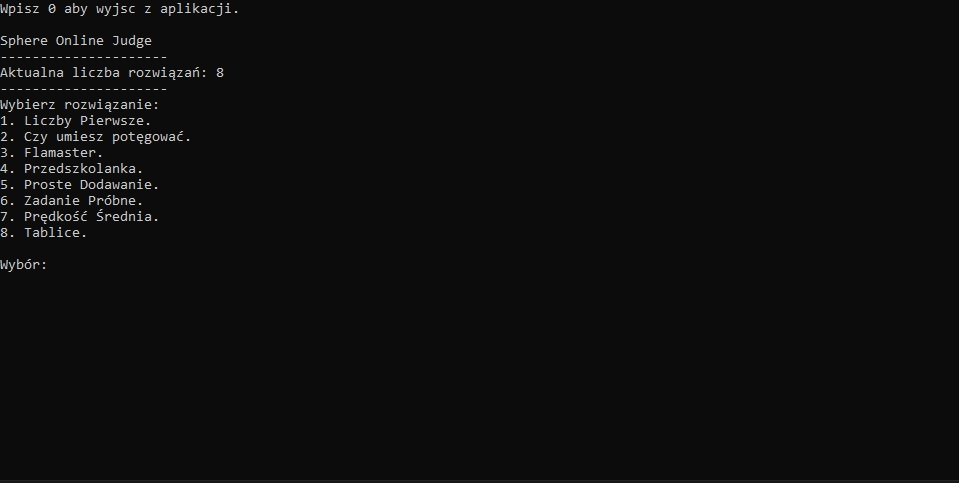
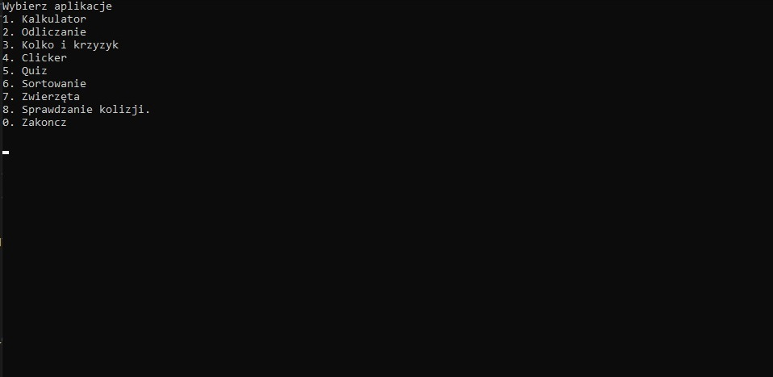

# :desktop_computer: Portfolio_CPP

The repository contains my C++ programs that I am working on and developing. CPP files are separate programs, where Project1 is the main program and Spoj.cpp is the program that I am currently working on. In the Spoj.cpp file, I place solutions to tasks from "https://pl.spoj.com/" with the same titles as on the website.

## :framed_picture: Screenshots

## :e-mail: Feedback

If you have any feedback, please reach out to me at kontaktkkeder@gmail.com
